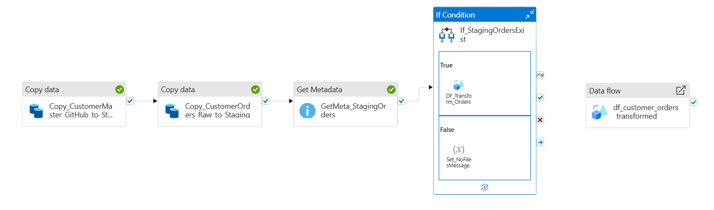
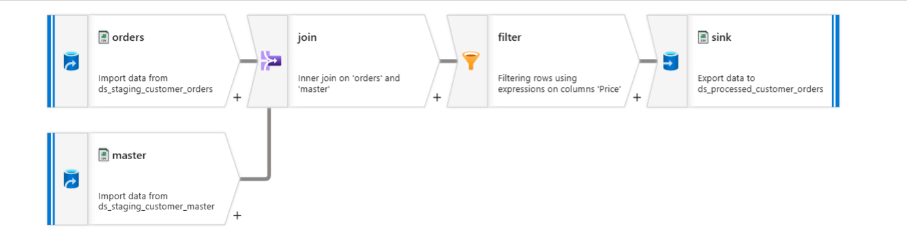

# 💼 Azure Data Factory End-to-End ETL Project

This project demonstrates an end-to-end ETL pipeline built using **Azure Data Factory (ADF)** that extracts data from two different sources (Azure Data Lake Gen2 and GitHub), transforms the data using **Mapping Data Flows**, and loads the processed data into a curated layer within ADLS Gen2. It showcases real-world pipeline orchestration using various ADF activities.

---

## 📌 Objective

To design a reusable, automated, and modular pipeline that:
- Ingests customer orders from Azure Data Lake Gen2
- Pulls customer master data from a GitHub HTTP source
- Performs join and transformation using Data Flows
- Writes enriched data to a processed layer
- Demonstrates the use of core ADF activities and triggers

---

## 📥 Input Datasets

1. **customer_orders.csv**  
   Location: `raw/customer_orders/` in ADLS Gen2  
   Contains: `order_id`, `customer_id`, `order_date`, `order_amount`

2. **customer_master.csv**  
   Source: GitHub (HTTP linked service)  
   Contains: `customer_id`, `customer_name`, `region`

---

## 🏗 Pipeline Structure

### ✅ Pipeline 1: `pl_ingestion_pipeline`

**Purpose**: Ingests raw data from both sources and stages them.

**Activities Used**:
- `Copy Data` (GitHub → staging/customer_master)
- `Copy Data` (raw → staging/customer_orders)
- `Get Metadata` (check file existence in staging)
- `If Condition` (proceed if file exists)

---

### 🔁 Pipeline 2: `pl_transformation_pipeline`

**Purpose**: Transforms staged data using Mapping Data Flows.

**Activities Used**:
- `Execute Data Flow`: Join `customer_orders` and `customer_master`
- `Filter`: Orders where `order_amount > 100`
- `Sink`: Save output to `processed/customer_orders_enriched/`

---

### 🧠 Mapping Data Flow: `df_customer_orders_transformed`

**Steps**:
1. Source 1: `staging/customer_orders`
2. Source 2: `staging/customer_master`
3. Join on `customer_id`
4. Filter where `order_amount > 100`
5. Sink to `processed/customer_orders_enriched/`

---

### 🔁 Modular Design

A third pipeline (`pl_main_orchestrator`) can be created to:
- Call `pl_ingestion_pipeline`
- Wait for success
- Then call `pl_transformation_pipeline`

**Activity**: `Execute Pipeline`

---

## ⏰ Triggers

1. **Schedule Trigger**: Runs every day at 2 AM UTC.
2. **Storage Event Trigger**: Kicks off ingestion pipeline when a new file lands in `/raw/customer_orders/`.

---

## 🔧 Linked Services

- **AzureBlobStorage_LS**: Connects to ADLS Gen2 container
- **GitHub_HTTP_LS**: Connects to GitHub raw CSV

---

## 🧰 ADF Activities Used

| Activity Name         | Description                                      |
|-----------------------|--------------------------------------------------|
| `Copy Data`           | Copies data from source to destination          |
| `Get Metadata`        | Checks for presence of files in a folder        |
| `If Condition`        | Conditional logic to continue pipeline          |
| `ForEach`             | (Prepared for scalability — not mandatory now)  |
| `Set Variable`        | Logs pipeline state (optional)                  |
| `Execute Pipeline`    | Modular orchestration between pipelines         |
| `Data Flow`           | Transforms, joins, and filters datasets         |
| `Schedule Trigger`    | Scheduled pipeline execution                    |
| `Storage Event Trigger`| Triggers pipeline when files arrive in raw zone|

---

## 🚀 How to Deploy

1. Set up an **Azure Data Lake Storage Gen2** and upload the `customer_orders.csv` file under `/raw/customer_orders/`.
2. Create an **Azure Data Factory** instance.
3. Create required **Linked Services** for ADLS and GitHub.
4. Create the above pipelines and **Data Flow** as described.
5. Publish all resources.
6. Manually trigger the main pipeline or wait for scheduled/event triggers.

---

## 📈 Output

The final enriched file `customer_orders_enriched.csv` will be available under:  
`/processed/customer_orders_enriched/`

It contains:
- `order_id`
- `customer_id`
- `customer_name`
- `order_date`
- `order_amount`
- `region`

---

## ✅ Naming Conventions

| Asset Type         | Naming Convention                 |
|--------------------|-----------------------------------|
| Pipelines          | `pl_<description>`                |
| Data Flows         | `df_<description>`                |
| Datasets           | `ds_<source>_<entity>`            |
| Linked Services    | `ls_<type>_<source>`              |
| Triggers           | `tr_<type>_<frequency>`           |
| Folders in ADLS    | `raw/`, `staging/`, `processed/`  |

---

## 💡 Possible Enhancements

- Add data quality checks or schema validations
- Send email notifications on failure/success
- Archive files after processing
- Parameterize pipeline for dynamic file handling
- Integrate with Logic Apps for alerting

---
### 📌 Pipeline Overview

### 🔄 Data Flow Diagram

